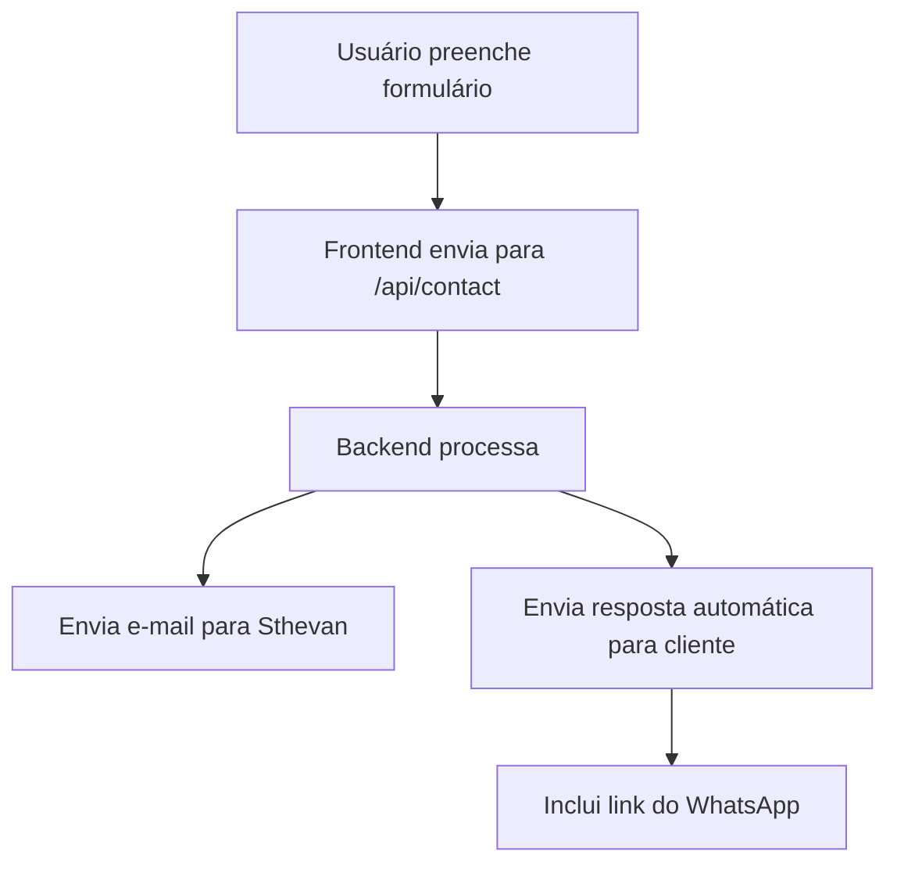

# Backend — Portfólio Sthevan Santos

## Objetivo

- Receber mensagens do formulário de contato do site
- Enviar e-mail para Sthevan com os dados do cliente
- Enviar resposta automática para o cliente com link do WhatsApp
- Possibilitar integrações futuras (ex: salvar no banco, enviar para outros canais)

---

## Tecnologias Sugeridas

- **Node.js + Next.js API Route** (integrado ao frontend)
- **Resend** (envio de e-mails simples e rápido)
- **Alternativas:** Nodemailer (SMTP), SendGrid, Firebase Functions

---

## Fluxo de Contato



---

## Exemplo de Endpoint (Next.js API Route)

```ts
// src/app/api/contact/route.ts
import { NextRequest, NextResponse } from 'next/server'
import { resend } from '@/lib/resend' // Exemplo de lib para envio

export async function POST(req: NextRequest) {
  const { name, email, message } = await req.json()

  // Envia e-mail para Sthevan
  await resend.send({
    to: 'seu@email.com',
    subject: 'Novo contato do portfólio',
    text: `Nome: ${name}\nEmail: ${email}\nMensagem: ${message}`
  })

  // Envia resposta automática para o cliente
  await resend.send({
    to: email,
    subject: 'Recebemos sua mensagem! 🚀',
    text: `Olá, recebemos sua mensagem! Em breve entraremos em contato.\nSe preferir, fale comigo no WhatsApp: https://wa.me/5527988772784`
  })

  return NextResponse.json({ ok: true })
}
```

---

## Futuras Integrações
- Salvar contatos em banco de dados
- Enviar para Slack, Discord, etc
- Dashboard de contatos recebidos

---

**DevLoop — Backend ágil, seguro e integrado ao seu negócio.** 